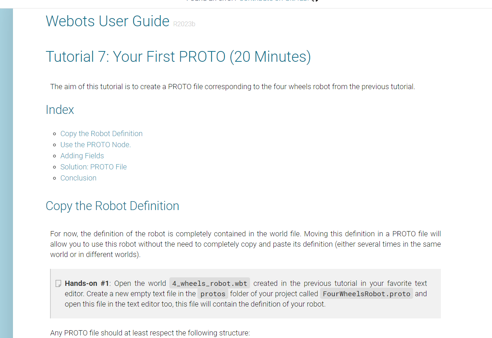
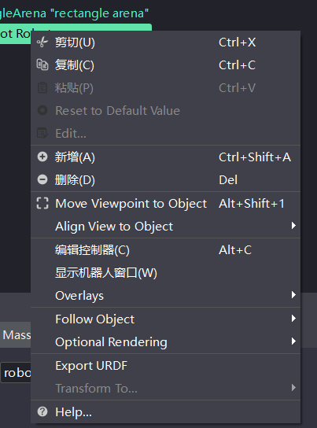
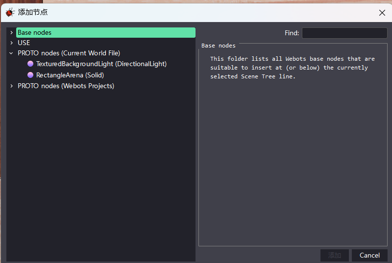
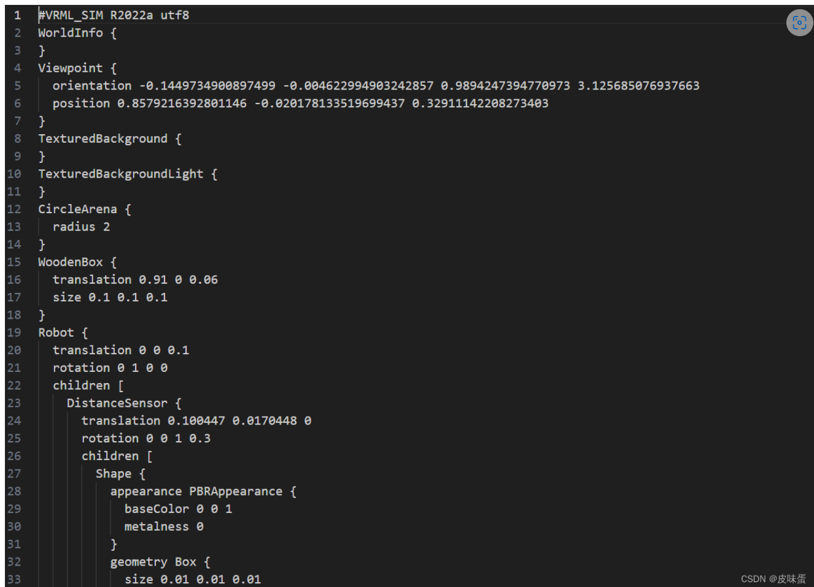

# 一，浅聊一下webots各个版本文件格式的导入导出
首先，早版本的webots是支持import VRML97的，例如webots 2020a。

但是随着webots的更新，到webots2022a支持URDF文件的导入导出，STL，dae，obj的文件格式的导入。SolidWorks可以导出URDF文件和STL文件

但在webots2022b后版本，文件菜单里就空空如也，但也可以导入一些东西。

# 二，具体的操作
       因为VRML97，STL，URDF等文件的格式在网络上的视频与文章已经很多了，我这里就不赘述了，我下面主要讲两个方面：一是利用代码实现高低版本模型的导入导出，二是2022b版本以后的导入。

## 1，利用代码实现高低版本模型的导入导出
在我们使用webots的过程中，我们可能会去下载他人的webots模型，这时就涉及到了高低版本的导入导出问题。首先，讲一下webots user guide中的Tutorial 7中的First PROTO，这个主要教我们如何建立自己的节点，这个就是可以把我们创作过的一些模型啊，假如你要在其他世界使用，就可以导出这个模型，先在是以2022b之前的版本为例，当然，高版本也是支持的。



在你建立好的robot右键



我这个是高版本的，低版本应该可以导出wbt文件，导出这个文件之后，我们可以把这个文件放入到你想要导入的世界的project中的protos文件中，之后你就可以点击新增，在proto nodes（current project）文件中找到这个。



这个说完了以后，下面就是代码的做法

首先你需要在project下面的protos文件下面新建一个，名称.proto的文件，把这个文件在vscode或者代码软件上打开，紧接着，你把下面这段代码复制上去

```
PROTO abc//把这里填写与你proto相同的名字和wbt的名字 [
    field SFVec3f    translation  0 0 0
    field SFRotation ritation     0 1 0 0
    field SFFloat    bodyMass     1
]
{
    Robot{
        translation IS translation
        rotation IS translation
        children[
            
        ]
        boundingObject USE BODY
        physics Physics{
            density -1
            mass IS bodyMass
        }
        controller "PID_Track"//这里是控制器名称
    }
}
```

之后，你可以把一个高版本的世界通过vscode打开，也就是.wbt文件通过vscode打开，这时，你会发现是一段代码，这段代码是VRML语言写的，然后根据你的需要可以把高版本的世界里面的robot，依照上面的格式一点点复制进去。最后，你就可以在低版本中打开这个模型机器人。




## 2，2022b版本以后的导入
这里我后面再添加，可以看看我好兄弟的视频
https://link.csdn.net/?target=https%3A%2F%2Fwww.bilibili.com%2Fvideo%2FBV1YG4y1L73Q%2F%3Fspm_id_from%3D333.337.search-card.all.click

原文链接：https://blog.csdn.net/qq_58870446/article/details/137232162

> 本篇文章受 [CC BY-NC-SA 4.0](https://creativecommons.org/licenses/by/4.0/deed.zh) 协议保护，转载请注明出处。
